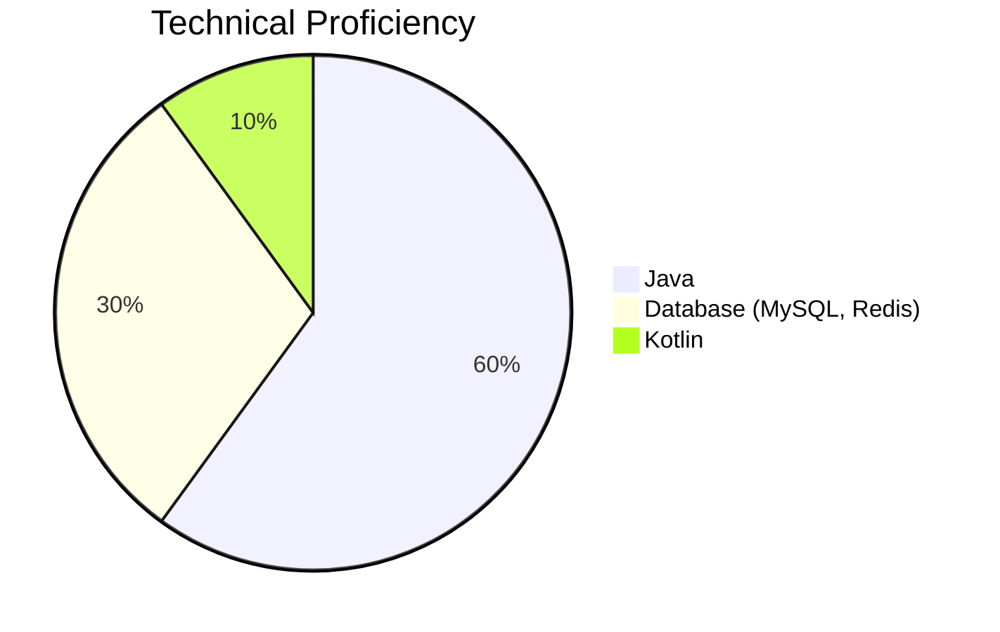

# Hi there 👋  
안녕하세요, **조성신**입니다.  

외식업계 4년, 스타트업 1년의 경험을 바탕으로 직접 서비스를 개발하고자 개발자로 전향했습니다.  
현재 **Java**를 중심으로 개발하고 있으며, 최근에는 **Kotlin**을 공부하며 역량을 확장하고 있습니다.  
효율적인 백엔드 설계와 MSA 구조에 관심이 많으며, 중복 없는 간결하고 명확한 코드를 선호합니다.  

유저, 운영, 기획, 개발의 다양한 관점을 고려하며, 효율적이고 실용적인 사용자 중심 솔루션을 협업하여 만들어가고자 합니다.

---

# 👨‍💻 About Me  
✔ **Contact**  
- **Email**: sungsin1030@gmail.com  
- **Resume (Notion)**: [Notion Resume](https://lydian-savory-0f5.notion.site/Backend-Developer-01cc68b1c4db43d8abf5ba354bcf0f1e)

✔ **What I Value**  
- **문제 해결 중심의 사고**: 비즈니스와 기술 문제를 효과적으로 해결할 수 있는 최적의 솔루션을 설계하는 데 주력하고 있습니다.  
- **효율적인 협업**: 다양한 팀원(기획, 디자이너, QA 등)과 원활히 소통하며 성과를 이끌어내는 데 강점을 가지고 있습니다.  
- **성장하는 기술 역량**: 트렌드에 발맞춰 **Kotlin**, **Redis**, **MSA** 등의 기술을 적극적으로 습득하고 적용하고 있습니다.

# 💪 Skills  

## ✔ Platforms & Languages  

  
  
  
  
  
  
  
  
  
  

  

## ▶ Technical Proficiency Chart
아래는 보유 기술에서 각각의 숙련도를 시각화한 차트입니다:

  

✔ **Java**  
- 가장 익숙하고 주력으로 사용하는 언어로 백엔드 아키텍처 설계와 REST API 구현에 주로 활용.  
- 관련 경험: 3년 이상.  

✔ **Database (MySQL, Redis)**  
- 데이터 최적화, 복잡한 쿼리 작성에 강점을 보이며 Redis 캐싱 기술도 사용.  
- 관련 경험: 3년 이상.

✔ **Kotlin**  
- JVM 환경 내에서 활용 가능한 언어로 점진적 학습 중이며, 기존 Java 코드를 확장하는 데 사용.  
- 관련 경험: 1년 미만.  

---

 

## ✔ Tools  

  
  
  
  
  
  

---

# 💡 Future Goals  
- **클라우드 기반 MSA 구조 학습**: AWS, Kubernetes를 심화적으로 학습 및 적용.  
- **코드 품질 강화**: `JUnit`, `Mockito` 등을 통해 테스트 커버리지를 높이고 코드 안정성을 강화.  
- **성능 최적화**: 대규모 트래픽에 대한 효율적인 처리 및 데이터베이스 성능 개선.  
